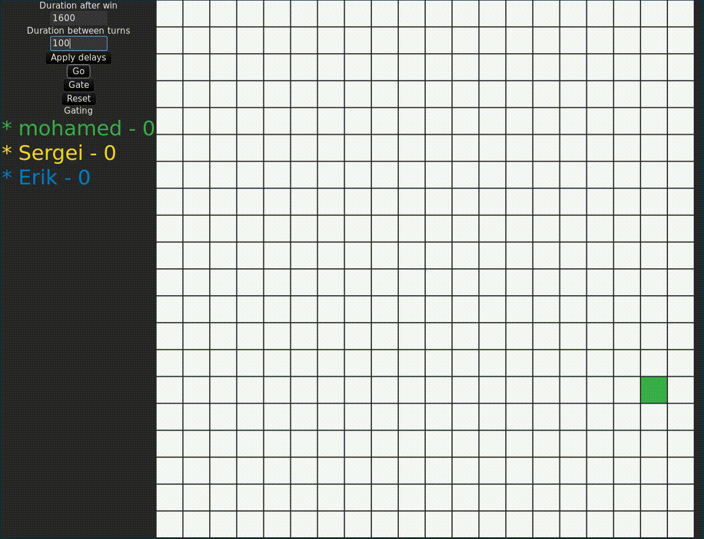

# Coding Challenge

## What is it

A framework for presenting coding challenges where participants implement algorithms to solve the same problem. The problem should be one where multiple algorithms compete with each other at the same time.

1. Gather a bunch of happy coders in a small room
2. Set up a server connected to a TV-screen to show the battle-grounds
3. Provide a link and explain the challenge to the participants.

## Demo



A 3 player game of Gomoku (5 in a row)

## How to set up a challenge

Prerequisites: rust

1. Clone this repo
2. cargo run
3. A UI should pop up, place it on a screen visible to all participants

## How to solve a challenge

Start from scratch, or use one of the sample starters below.

* https://github.com/souze/code-challenge-python-client-skeleton

For the participants, every challenge has roughly the same structure.

```text
1. Connect to the server (The host should have provided you with IP:port)
2. Provide a username (See [authentication message](#auth) below)
3. ╭─╭─ The server will send the state of the world [your turn](#your-turn)
4. | |  The client will answer with their next move [player moves](#player-move)
5. | ╰─ Repeat from step 3
6. |  The server will announce a winner when the game is over [game ends](#game-over)
7. ╰─ Repeat from step 3
```

For specifics on your particular game, go to the game-specific section here:

* [gomoku](src/games/gomoku.md)

# Protocoll

The client should connect through ordinary TCP connection, and exchange message using JSON-format, each one terminated by a newline. The content of the JSON message can not contain a newline.

## Auth

First message that is sent upon client connection.

The password below is set the first time you connect, and you should reuse the same username/password connection on every connection after that.

> Client -> Server

```json
{"auth":
    {"username": "your_name",
     "password": "your_password"
     }}
```

## Your turn

Game state below will be different for each game. See the details in the README for the specific game you're playing.

> Server -> Client

```json
{"your-turn": {game_state}}
```

## Player move

Player move below will be different for each game. See the details in the README for the specific game you're playing.

> Client -> Server

```json
{"move": {player_move}}
```

## Game over

After the game over message has been sent, a new round will immediately begin.

> Server -> Client

```json
{"game-over":
    {"reason": "winner <username>"|"draw"}}
```

## Errors

In case the server receives input that it can not understand, or is invalid, the client will be sent an error message, and immediately disconnected.

> Server -> Client

```json
{"error":
    {"reason": "invalid move"|"invalid message format"|"wrong password"}}
```
